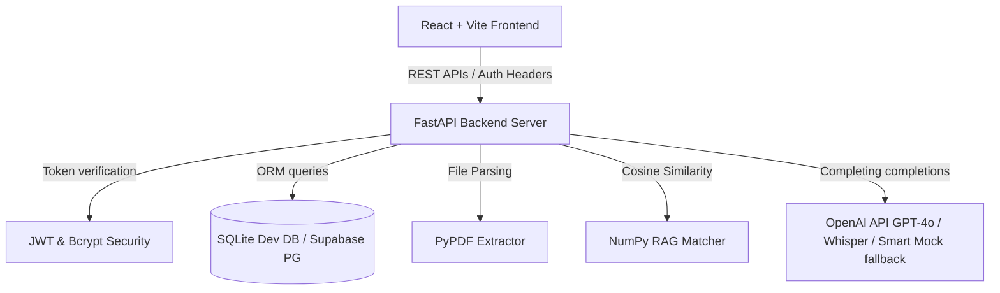

# AI Interview Copilot 🚀

AI Interview Copilot is an immersive SaaS-like platform where candidate job seekers upload resumes, obtain ATS scorecards, optimize summarize statements, and face interactive mock interview rounds (incorporating Monaco coding boards, live visualizers, and Whisper speech transcribers).

---

## Technical Architecture

Below is the conceptual layout of client interactions, service controllers, database session repositories, and AI systems.



---

## Directory Structure

```
ai-interview-copilot/
├── .github/
│   └── workflows/
│       └── ci.yml             # GitHub Actions CI Workflow
├── backend/
│   ├── app/
│   │   ├── core/              # Security, JWT auth, system settings
│   │   ├── database/          # Base models, SQLite db session
│   │   ├── schemas/           # Pydantic schema validation structures
│   │   ├── services/          # OpenAI services, PDF readers, NumPy RAG matching
│   │   ├── routers/           # REST endpoints (auth, resume, interview, analytics)
│   │   └── main.py            # App orchestration entrypoint
│   └── requirements.txt
├── frontend/
│   ├── src/
│   │   ├── components/        # Layout wrappers, navigation sidebars
│   │   ├── contexts/          # JWT Session handlers
│   │   ├── pages/             # landing, login, resume analysis, monaco interview rooms, reports
│   │   ├── services/          # Axios HTTP clients
│   │   ├── App.tsx            # Routes orchestrator
│   │   └── index.css          # Tailwind CSS v4 design imports
│   └── package.json
├── docker/
│   ├── Dockerfile.backend
│   ├── Dockerfile.frontend
│   └── docker-compose.yml     # Multi-container local deployment
└── README.md
```

---

## Database ER Diagram Entities

1. **User Table**: Candidate details, password hashes, accumulated XP, leveling tier, streaks, and timestamps.
2. **Resume Table**: Raw parsed text, ATS percentage grade, strengths/weaknesses (JSON), and STAR summary optimization rewrites.
3. **InterviewSession Table**: Target role, template company style, difficulty level, final performance summary scores, and AI-generated roadmaps.
4. **InterviewQuestion Table**: Question prompt details, order markers, coding text templates, and bookmark indices.
5. **UserAnswer Table**: Candidate text inputs, submitted code scripts, grammar evaluations, and STAR methodology metrics.
6. **Badge Table**: Gamification achievements unlocked (e.g. "3-Day Burn").
7. **DocumentChunk Table**: Vector libraries index storing PDF manuals and serialized embeddings for similarity searching.

---

## REST API Overview

### 1. Authentication
- `POST /auth/register` - Create a new user profile.
- `POST /auth/login` - Authenticate credentials and return JWT bearer token.
- `GET /auth/me` - Fetch details for current authenticated profile session.

### 2. Resume Analyzer
- `POST /resume/upload` - Extract PDF text, run ATS parsing and skill audits.
- `POST /resume/optimize/{id}` - Rebuild profile summaries and projects in STAR formats.
- `GET /resume/latest` - Fetch the latest parsed candidate resume.

### 3. Interview Engine
- `POST /interview/start` - Initialize mock sessions, generating 5 tailored questions.
- `POST /interview/submit-answer` - Submit inputs and return instant AI scoring feedback.
- `POST /interview/voice-transcribe` - Upload microphone WAV audio blobs to transcribe via Whisper.
- `POST /interview/finish/{id}` - Close sessions, compile aggregated scores, personalized roadmaps, and award XP milestone achievements.

### 4. Reference Library & RAG
- `POST /rag/upload` - Upload PDF/TXT interview guides and run chunk vectorization.
- `POST /rag/search` - Perform Cosine Similarity context search using NumPy.

---

## Installation & Running Locally

### Backend Setup
1. Navigate to the backend directory:
   ```bash
   cd backend
   ```
2. Set up virtual environment and install packages:
   ```bash
   python -m venv venv
   source venv/Scripts/activate # Windows
   pip install -r requirements.txt
   ```
3. Initialize the database and launch the dev server:
   ```bash
   uvicorn app.main:app --reload --port 8000
   ```

### Frontend Setup
1. Navigate to the frontend directory:
   ```bash
   cd frontend
   ```
2. Install package dependencies:
   ```bash
   npm install
   ```
3. Run the Vite development server:
   ```bash
   npm run dev
   ```
   Open `http://localhost:5173` in your browser.

---

## Docker Container Running

To run both services orchestrating together using Docker:
```bash
cd docker
docker-compose up --build
```
This maps the FastAPI server to `http://localhost:8000` and the React frontend to `http://localhost:80`.
